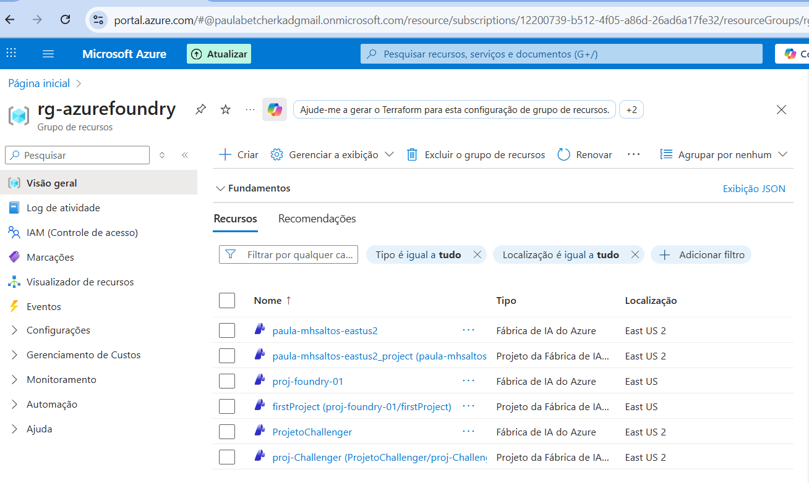
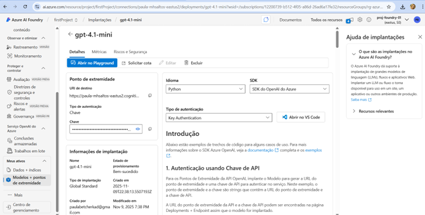
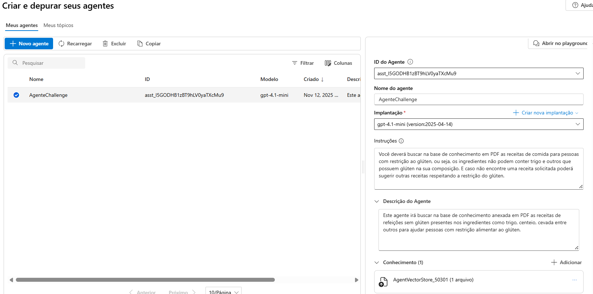
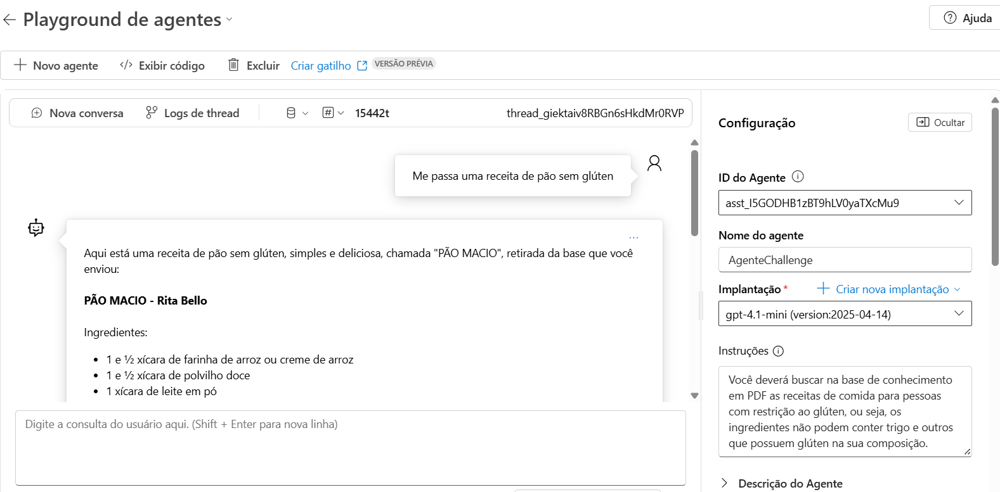
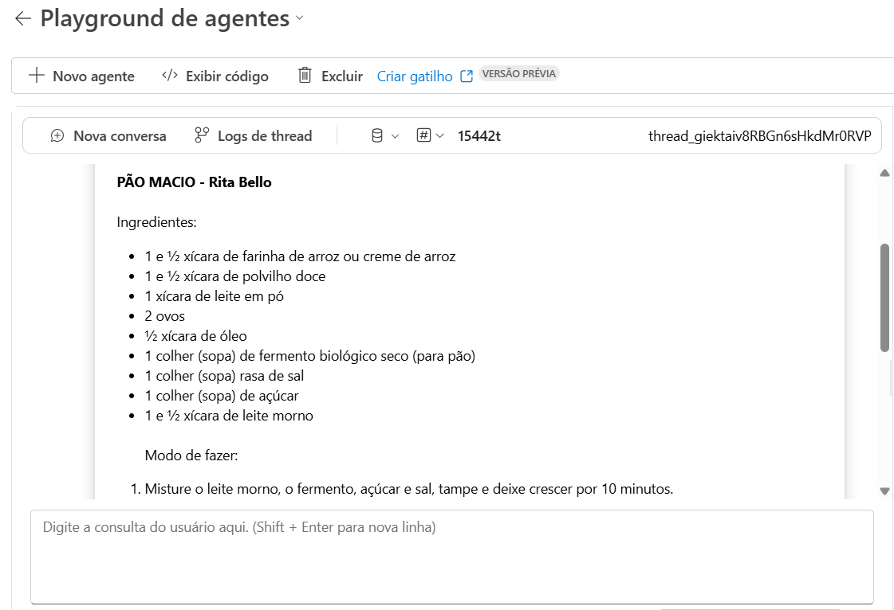
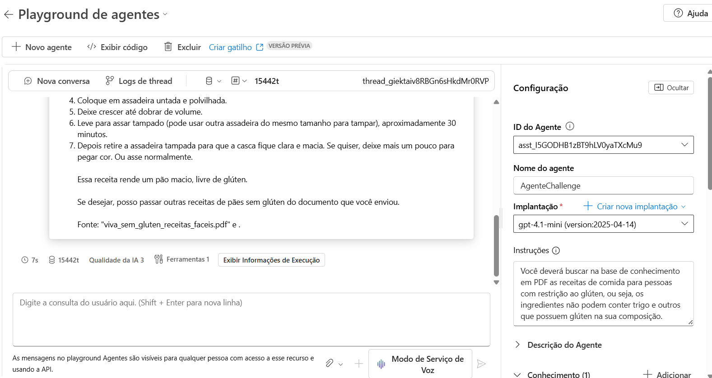

# AgenteSemGluten
Azure Frontier Girls – Challenger Criação de um agente AI

Aluna: Paula Betcher Bortolai

e-mail: paulabbp@msn.com

Data: 16/11/2025

Requisitos para Elegibilidade

O repositório da participante deve conter:

  -	Repositório público no GitHub com nome do agente
  -	README completo, incluindo:
    -	Descrição do projeto e objetivo do agente
    -	Prints de respostas, fluxo e execução
    - Links de referências (Foundry, Power Automate, etc.)
  -	Agente funcional no Foundry, com:
    -	Pelo menos 1 ação funcional (ex.: cálculo, busca ou automação simples)
  -	Entrega dentro do prazo
    -	Prazo para entrega 23/11/2025 as 23:59

Grupo de recursos criado
rg-azurefoundry  

Projeto no Azure AI Foundry criado
paula-mhsaltos-eastus2_project  
https://paula-mhsaltos-eastus2.services.ai.azure.com/api/projects/paula-mhsaltos-eastus2_project  

Agente criado
AgenteChallenge  
    

Modelo usado:
GPT 4.1 mini

Descrição do Agente:  
Este agente se baseia no moedlo GPT 4.1 mini. Ele deverá buscar somente receitas salgada e doces sem glúten em base conhecimento do arquivo carregado em PDF, e caso não encontre uma receita solicitada poderá sugerir e montar receitas diversar com restrição de glúten.

Objetivo do Projeto:  
Ser uma pessoa intolerante a glúten é ter dificuldade em digerir o glúten, uma proteína encontrada em cereais como trigo, cevada e centeio. Essa condição causa desconforto e sintomas variados, como inchaço abdominal, gases, diarreia ou constipação, dores de cabeça e fadiga.
O objetivo é o agente ajudar estas pessoas com restrição ao glúten a buscar receitas de comida sem a presença do glúten, ou seja, os ingredientes não podem conter trigo, cevada, centeio e outros que possuem glúten na sua composição. 
Esta condição alimentar incetiva o indivíduo a confeccionar suas próprias receitas pois comer fora nem sempre os estabelecimentos não se preocupam com esta situação além de encarecer o valor do preparo e continuam a servir refeições com glúten.
Portanto este agente será de insuma importância para a vida destas pessoas, além de sugerir deliciosas receitas, incentivará a confecção da sua própria refeição garantindo uma alimentação saudável e minimizando os riscos a saúde.  

Playgound do Foundry.  
  

O assistente de IA busca a receita de pão sem glúten  
    

O assistente de IA traz a referência da receita 
    

Foi solicitado uma receita de noque não existente no PDF e o agente foi capaz se mostrar uma receita respeitando a condição solicitada sem glúten.   
      
      
     
