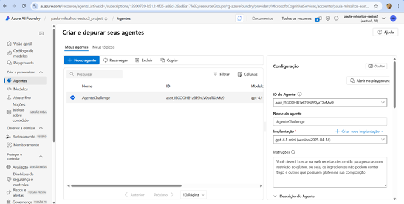

# AgenteSemGluten
Azure Frontier Girls – Challenger Criação de um agente AI

Aluna: Paula Betcher Bortolai

e-mail: paulabbp@msn.com

Data: 16/11/2025

Requisitos para Elegibilidade
O repositório da participante deve conter:
•	Repositório público no GitHub com nome do agente
•	README completo, incluindo:
o	Descrição do projeto e objetivo do agente
o	Prints de respostas, fluxo e execução
o	Links de referências (Foundry, Power Automate, etc.)
•	Agente funcional no Foundry, com:
o	Pelo menos 1 ação funcional (ex.: cálculo, busca ou automação simples)
•	Entrega dentro do prazo
o	Prazo para entrega 21/11/2025 as 23:59

Grupo de recursos criado
rg-azurefoundry

Projeto no Azure AI Foundry criado
paula-mhsaltos-eastus2_project

Agente criado
AgenteChallenge  
  

Modelo usado:
GPT 4.1 mini

Descrição do Agente:
Ser uma pessoa intolerante a glúten é ter dificuldade em digerir o glúten, uma proteína encontrada em cereais como trigo, cevada e centeio. Essa condição causa desconforto e sintomas variados, como inchaço abdominal, gases, diarreia ou constipação, dores de cabeça e fadiga
O agente irá ajudar estas pessoas com restrição ao glúten a buscar receitas de comida sem a presença do glúten, ou seja, os ingredientes não podem conter trigo, cevada, centeio e outros que possuem glúten na sua composição. 
Pois comer fora nem sempre os estabelecimentos não se importam com esta situação e servem refeições com glúten e assim as pessoas são incentivas a confeccionar sua própria refeição.

Está em anexo os prints das telas da criação do projeto e agente, e testes realizados no Playgound do Foundry.

https://paula-mhsaltos-eastus2.services.ai.azure.com/api/projects/paula-mhsaltos-eastus2_project
